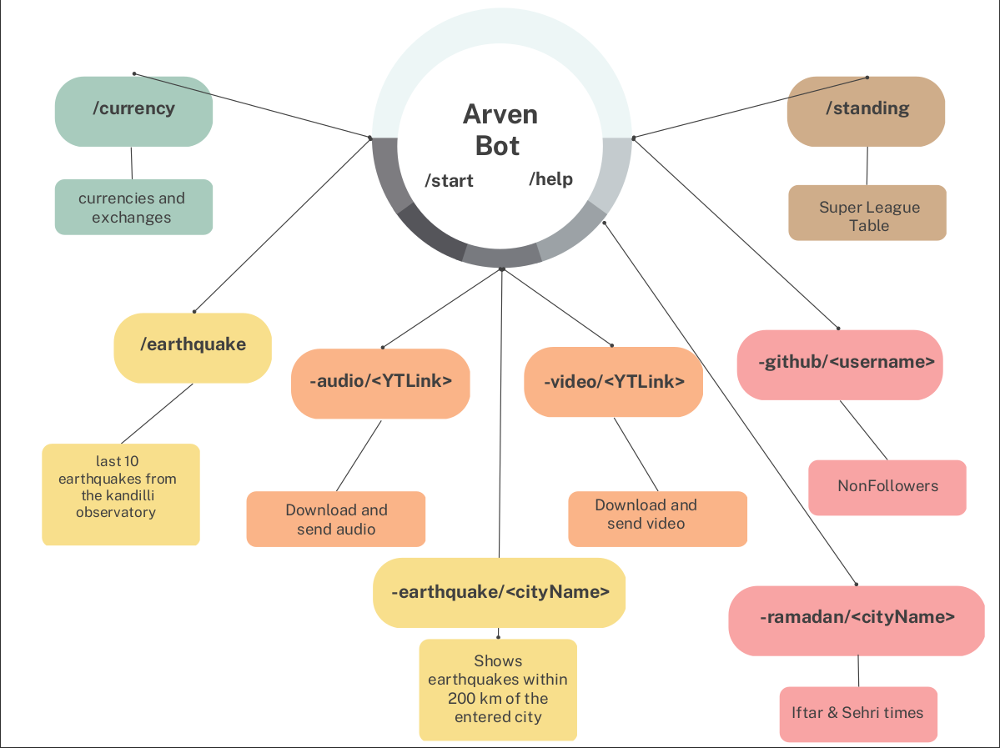
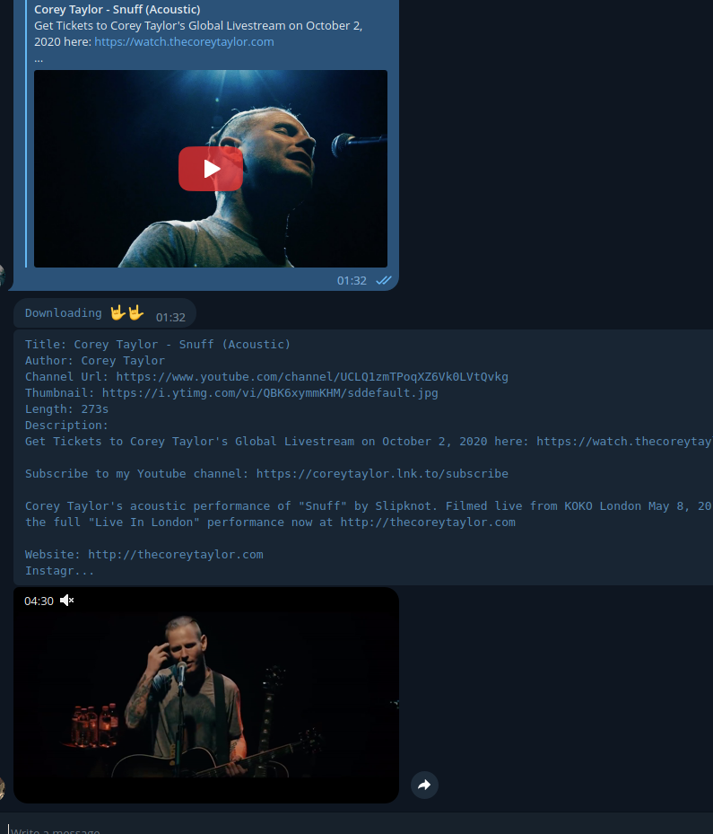
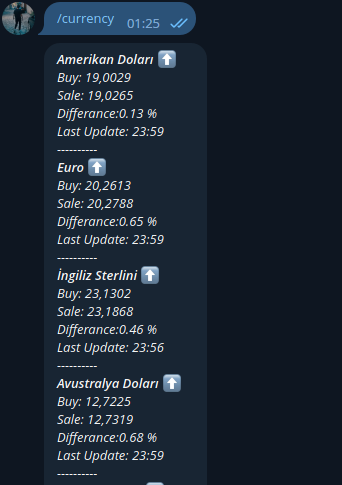
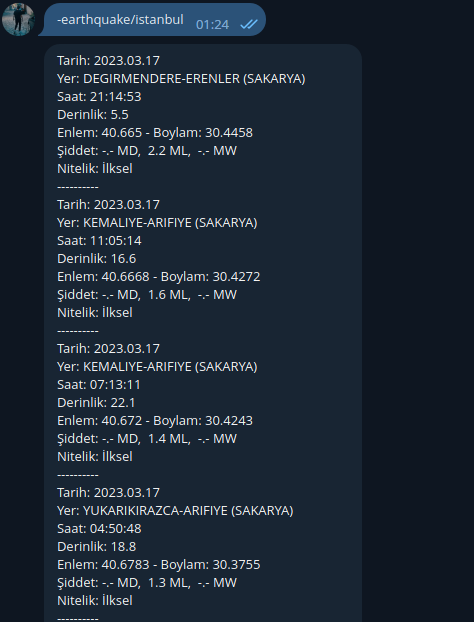
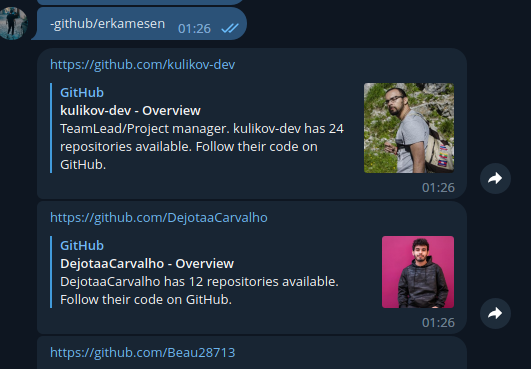
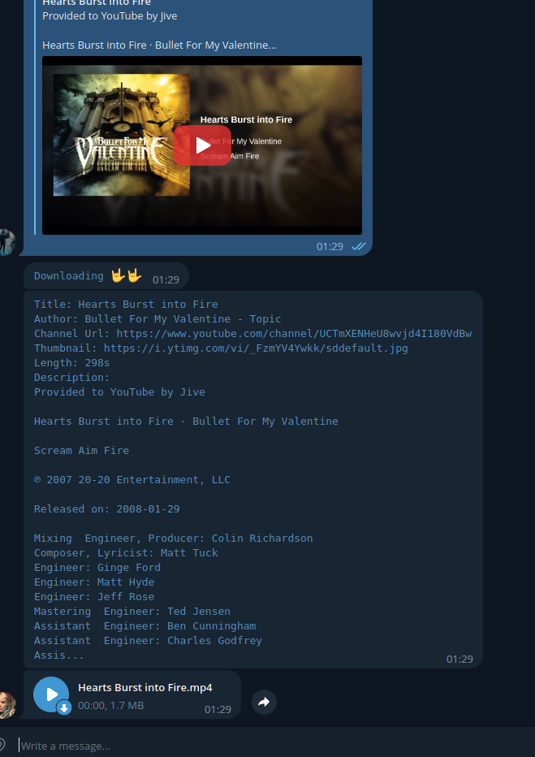

# Telegram Bot

<i>Your personal assistant</i>





## Commands List
- /start
- /help - - Loading ⏳⏳
- /currency 
- /earthquake 
- /standing
- -earthquake/< cityName > 
- -audio/< YouTubeLink >
- -video/< YouTubeLink >
- -github/< username >
- -lolstats/< username > - - Loading ⏳⏳
- -lyric/< song > - - Loading ⏳⏳
- -recipe/< mealName > - - Loading ⏳⏳
- -matches/< teamName > - - Loading ⏳⏳


## Features
- You can follow the currencies and their changes. 
- You can track the last 10 earthquakes and their details. (from Kandilli Observatory - TR)
- The coordinates of all earthquakes in the last earthquake list according to the coordinates of the city you have written are compared and the distances are calculated. If the distance is less than 200 in kilometers, matching earthquakes are displayed.
- With the youtube link, you can easily download the video or the audio file. Your Telegram Bot will download them for you and send them to you. After sending, these files will be deleted so that they do not take up space on your disk.
- You can find  who didn't follow you back by entering your github username. Since the messages will be sent as a link, you can easily click and unfollow. <br>
⚠️ Warning: the more followers and followers you have, the longer the response time of this command will be. As the Github follower page increases according to the number of people, the page the bot goes to will increase as well.
- You can follow the super league standings instantly.


## Install & Usage
Clone repository to your local:
```
git clone https://github.com/erkamesen/Telegram-ArvenBOT.git
```
Navigate to directory:
```
cd Telegram-ArvenBOT
```
- Install Requirements
```
pip install -r requirements.txt
```
- [Create](https://sendpulse.com/knowledge-base/chatbot/telegram/create-telegram-chatbot) your telegram bot.
- Set your own APIToken in telebot.py 
```
APIKEY = os.getenv("APIKey") # Replace your Token - Line 13
```

- Run application
```
python3 telebot.py
```

## Dependencies

<table>
<thead>
<tr><th>Package</th><th>Version</th></tr>
</thead>
<tbody>
<tr><td>beautifulsoup4</td><td>4.11.2</td></tr>
<tr><td>numpy</td><td>1.24.2</td></tr>
<tr><td>python-dotenv</td><td>1.0.0</td></tr>
<tr><td>python_telegram_bot</td><td>13.7</td></tr>
<tr><td>pytube</td><td>12.1.2</td></tr>
<tr><td>requests</td><td>2.25.1</td></tr>
<tr><td>selenium</td><td>4.8.2</td></tr>
<tr><td>telegram</td><td>0.0.1</td></tr>
</tbody>
</table>

## Snaps

### -video/< YouTubeLink > 


### /currency 


### /earthquake 


### -earthquake/< cityName > 


### -github/< username > 



### -audio/< YouTubeLink > 



